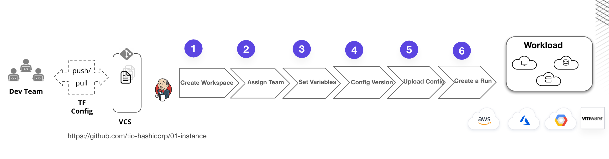

# snapshot-tfeapi
 
Terraform (especially via Terraform Cloud or Terraform Enterprise) provides a rich HTTP API that allows you to orchestrate and automate infrastructure provisioning as part of your broader application or platform workflows.

Instead of relying solely on the terraform CLI, you can use the Terraform API to programmatically:  
 	1.	**Create and Manage Workspaces**  
	•	Automate the setup of Terraform environments per project or team  
	•	Useful for multi-tenant SaaS platforms or internal dev portals   
 
	2.	**Trigger Runs** 
	•	Start plan and apply operations via API  
	•	Triggered from a CI/CD pipeline, event hook, or custom UI  

 3.	**Pass Variables and Configuration**  
	•	Inject input variables at runtime  
	•	Securely manage secrets without storing them in version control  

 4.	**Track Status**  
	•	Poll for run status, view plan outputs, apply results  
	•	Build dashboards or alerting based on provisioning status  

 5.	**Audit and Approvals**  
	•	Use the API to programmatically enforce manual approvals or retrieve run history for compliance  
